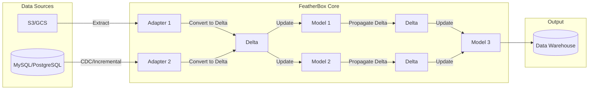
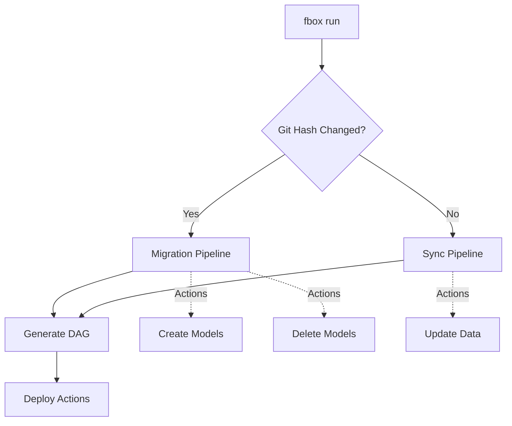

# FeatherBox Core

FeatherBox Core is a lightweight, easy-to-use data pipeline framework designed for developers.

## Features and Benefits

- All-in-one data pipeline framework
  - Extract, Load, Transform data from various sources.
- Use Duckdb and DuckLake (Catalog format)
  - Very Fast!
- Automatic pipeline management
  - You only need to define adapters and models.
- Single binary for all operations
  - No need to install dependencies, just run the binary.
  - CI/CD friendly.

## Command

```bash
fbox init [project_name]   # Initialize a new FeatherBox Core project
fbox adapter new <name>    # Create a new adapter
fbox adapter delete <name> # Delete an adapter
fbox model new <name>      # Create a new model
fbox model delete <name>   # Delete a model
fbox migrate up            # Apply pending migrations
fbox migrate status        # Check migration status
fbox run                   # Generate pipelines and run them
```

## Examples

```
project.yml

./adapters
├── app_logs.yml
└── app_db.yml

./models
├── app_db
│   ├── users.yml
│   └── orders.yml
├── app_logs
│   ├── app_log.yml
│   ├── task_log.yml
│   └── job_log.yml
├── staging
│   ├── users.yml
│   ├── access_logs.yml
│   ├── task_logs.yml
│   ├── job_logs.yml
│   └── orders.yml
└── datastore
    ├── active_users.yml
    ├── sales.yml
    └── orders.yml
```

### Project Settings

```yaml
storage:
  type: local
  path: ./storage

database:
  type: sqlite
  path: ./database.db

deployments:
  timeout: 600

connections: {}
```

### Adapters

- Time Series Data

```yaml
name: app_logs
connection: app_logs
file:
  path: <YYYY>/<MM>/<DD>/*_<YYYY><MM><DD>T<HH><MM>.log.gz
  compression: gzip
  max_batch_size: 100MB

update_strategy:
  detection: filename
  timestamp_from: path
  range:
    since: 2023-01-01 00:00:00

format:
  type: csv
  delimiter: ' '
  null_value: '-'
  has_header: false

columns:
  - name: timestamp
    type: datetime
  - name: level
    type: string
  - name: message
    type: string
```

- Relational data

```yaml
type: mysql # or 'postgresql', 'sqlite'
config:
  host: localhost
  port: 3306 # or 5432 for Postgre
  user: $YOUR_USERNAME
  password: $YOUR_PASSWORD
  dbname: $YOUR_DATABASE_NAME
incremental:
  type: cdc # or 'columner'
  ...
max_batch_records: 10000
```

### Models

```yaml
name: active_users
sql: |
  SELECT
    COUNT(*) AS active_users,
    DATE(created_at) AS date
  FROM users
  WHERE last_login >= NOW() - INTERVAL '30 days'
  GROUP BY DATE(created_at)
  ORDER BY DATE(created_at) DESC
max_age: 1d
```

## Architecture

FeatherBox Core adopts a delta-based update architecture to achieve efficient data pipeline processing.

### Core Components

1. **Adapter**: Defines connections to external data sources (S3, MySQL, PostgreSQL, etc.)
2. **Model**: Defines data transformation logic using SQL
3. **Delta**: Manages differential data and propagates changes between models
4. **Pipeline**: Automatically generates DAG from adapter and model dependencies
5. **Deployment**: Executes pipeline actions

### Data Flow



### Pipeline Generation Process



### Delta Update Mechanism

1. **Delta Extraction from Data Sources**
   - S3: Detects file path changes (filename-based or content-based)
   - RDB: CDC (Change Data Capture) or column-based incremental updates

2. **Delta Propagation**
   - Records changes from upstream models as Delta
   - Downstream models receive Delta and update their data
   - Generates new Delta from update results and propagates further downstream

3. **Delta Processing Flow**
   - Extract changes from adapters (new files, CDC events, etc.)
   - Convert to standardized Delta format
   - Apply Delta to target model tables
   - Generate new Delta for downstream models

## Database Schema

```sql
-- Graphs: Pipeline execution versions
CREATE TABLE IF NOT EXISTS "__fbox_graphs" (
  "id" integer NOT NULL PRIMARY KEY AUTOINCREMENT,
  "created_at" datetime_text NOT NULL DEFAULT CURRENT_TIMESTAMP
);

-- Pipelines: Execution records
CREATE TABLE IF NOT EXISTS "__fbox_pipelines" (
  "id" integer NOT NULL PRIMARY KEY AUTOINCREMENT,
  "graph_id" integer NOT NULL,
  "created_at" datetime_text NOT NULL DEFAULT CURRENT_TIMESTAMP,
  FOREIGN KEY ("graph_id") REFERENCES "__fbox_graphs" ("id")
);

-- Nodes: Tables/models in the pipeline
CREATE TABLE IF NOT EXISTS "__fbox_nodes" (
  "id" integer NOT NULL PRIMARY KEY AUTOINCREMENT,
  "graph_id" integer NOT NULL,
  "name" varchar NOT NULL,
  FOREIGN KEY ("graph_id") REFERENCES "__fbox_graphs" ("id")
);

-- Edges: Dependencies between nodes
CREATE TABLE IF NOT EXISTS "__fbox_edges" (
  "id" integer NOT NULL PRIMARY KEY AUTOINCREMENT,
  "graph_id" integer NOT NULL,
  "from_node" varchar NOT NULL,
  "to_node" varchar NOT NULL,
  FOREIGN KEY ("graph_id") REFERENCES "__fbox_graphs" ("id")
);

-- Pipeline Actions: Execution steps
CREATE TABLE IF NOT EXISTS "__fbox_pipeline_actions" (
  "id" integer NOT NULL PRIMARY KEY AUTOINCREMENT,
  "pipeline_id" integer NOT NULL,
  "table_name" varchar NOT NULL,
  "execution_order" integer NOT NULL,
  FOREIGN KEY ("pipeline_id") REFERENCES "__fbox_pipelines" ("id")
);
```

## Functional Design

### Initialization

Creates a new FeatherBox Core project structure.

```bash
fbox init
```

1. **Project Setup**
   - Interactive prompts
     - project name
     - Storage configuration (local/S3/GCS)
     - Database configuration (SQLite/MySQL/PostgreSQL)
   - Creates `project.yml` with default configuration
   - Creates directory structure:

     ```
     ./adapters/    # Adapter definitions
     ./models/      # Model definitions
     ```

   - Initializes database schema

### Create Adapters

Defines new data source connections.

```bash
fbox adapter new <adapter_name>
```

1. **Adapter Creation**
   - Creates YAML file in `./adapters/` directory
   - Validates configuration syntax
   - Tests connection to data source
   - Registers adapter in database

2. **Supported Types**
   - **Time-series data**: Currently supports local files only (S3, GCS planned)
   - **Relational data**: Currently supports SQLite only (MySQL, PostgreSQL planned)

### Delete Adapters

Removes adapter and associated data.

```bash
fbox adapter delete <adapter_name>
```

1. **Validation**
   - Checks for dependent models
   - Delete dependencies

2. **Delete Files**

### Create Models

Defines data transformation logic.

```bash
fbox model new <model_name>
```

1. **Model Creation**
   - Creates YAML file in appropriate subdirectory under `./models/`
   - Validates SQL syntax

2. **Dependency Detection**
   - Parses SQL to identify referenced tables
   - Validates circular dependencies

### Delete Models

Removes model and downstream dependencies.

```bash
fbox model delete <model_name>
```

1. **Validation**
   - Checks for dependent models
   - Delete dependencies

2. **Delete Files**

### Generate Pipelines and Run Them

Core execution engine for data processing.

```bash
fbox run
```

0. **Validate Untracked Changes**
   - Checks for uncommitted changes in `./adapters/` and `./models/`
   - Exit if untracked changes are found

1. **Pipeline Generation**
  1.1 **Git Hash Check**:
  1.2 **Pipeline Type Decision**:
     - If Git hash has changed, run migration pipeline
     - If Git hash is unchanged, run sync pipeline
  1.3 **DAG Generation**:
     - Constructs Directed Acyclic Graph (DAG) from adapters and models
     - Identifies dependencies and execution order
  1.4 **Action Creation**:

2. **Migration Pipeline** (Git hash changed)
   - **Analyze Changes**:
     - Compares current configuration with last deployed state
     - Identifies added/modified/deleted adapters and models

   - **Generate Actions**:
     - `destroy` actions for deleted models (reverse topological order)
     - `create` actions for new models (topological order)
     - `update` actions for all models to refresh data

3. **Sync Pipeline** (Git hash unchanged)
   - **Freshness Check**:
     - Evaluates each model's `max_age` setting
     - Identifies stale data based on last execution time

   - **Generate Update Actions**:
     - Creates `update` actions only for stale models
     - Propagates updates through dependency chain

4. **Deployment Execution**
   - **Action Scheduling**:
     - Sorts actions by priority and dependencies
     - Executes actions in parallel where possible
     - Respects deployment timeout

   - **Delta Processing**:

     ```
     Adapter → Extract Changes → Convert to Delta → Apply to Model → Propagate Delta
     ```

   - **Error Handling**:
     - Retries transient failures
     - Rolls back on critical errors
     - Logs all operations

5. **Monitoring**
   - Real-time progress updates
   - Detailed logging to `deployment_logs`
   - Performance metrics collection


TODO

```yaml
connection: test_data
description: 'Configuration for processing web server logs'
file:
  path: <YYYY>/<MM>/<DD>/*_<YYYY><MM><DD>T<HH><MM>.log.gz
  compression: gzip
  max_batch_size: 100MB
update_strategy:
  detection: filename
  timestamp_from: path
  range:
    since: 2023-01-01 00:00:00
format:
  type: 'json'
columns:
  - name: timestamp
    type: DATETIME
    description: 'The timestamp of the log entry'
  - name: path
    type: STRING
    description: 'The path of the request'
  - name: method
    type: STRING
    description: 'The HTTP method of the request'
  - name: status
    type: INTEGER
    description: 'The HTTP status code of the response'
  - name: response_time
    type: INTEGER
    description: 'The time taken to process the request in milliseconds'
  - name: user_agent
    type: STRING
    description: 'The user agent of the client making the request'
```
