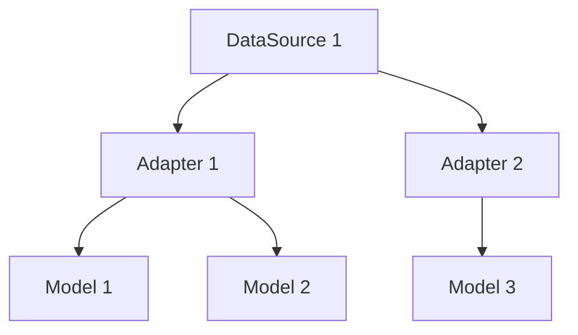
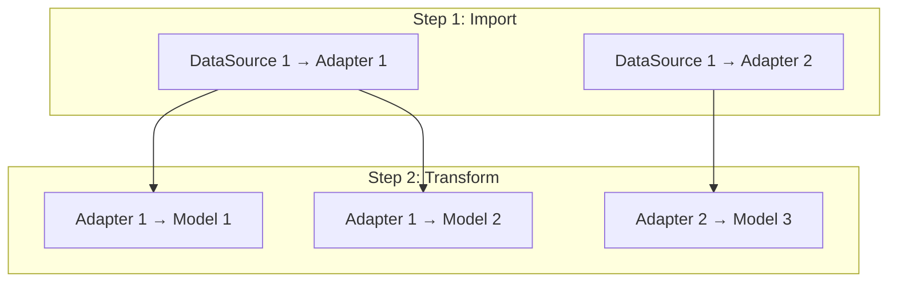

# FeatherBox Core

A lightweight data pipeline framework built in Rust for Extract, Load, Transform (ELT) operations using DuckDB and DuckLake.

## Features

- **Single Binary**: No dependencies, CI/CD friendly
- **High Performance**: DuckDB + DuckLake integration
- **Automatic Pipeline Management**: Define adapters and models only
- **Web UI**: Visual interface for configuration and monitoring

## Commands

```bash
# Project Management
fbox new [project_name]    # Initialize new project
fbox start <project_name>  # Start web UI and API server

# CLI Configuration (optional - can also use web UI)
fbox adapter new <name>    # Create adapter configuration
fbox model new <name>      # Create model configuration
fbox migrate               # Run database migrations
fbox run                   # Execute pipeline with differential execution

# Server Mode
fbox server                # Start API server only (port 3000)
```

## Getting Started

### Quick Start with Web UI
```bash
# Create a new project
fbox new my-project

# Start the web interface
fbox start my-project
```

This will:
- Start the API server on http://localhost:3000
- Start the web UI on http://localhost:5173  
- Automatically open your browser to the UI

## Configuration Examples

### Project Settings (project.yml)

```yaml
storage:
  type: local
  path: ./storage

database:
  type: sqlite
  path: ./database.db

connections: {}
```

### Adapter Configuration

```yaml
name: app_logs
connection: app_logs
file:
  path: <YYYY>/<MM>/<DD>/*_<YYYY><MM><DD>T<HH><MM>.log.gz
  compression: gzip
format:
  type: csv
  delimiter: ' '
columns:
  - name: timestamp
    type: datetime
  - name: level
    type: string
  - name: message
    type: string
```

### Model Configuration

```yaml
name: active_users
sql: |
  SELECT
    COUNT(*) AS active_users,
    DATE(created_at) AS date
  FROM users
  WHERE last_login >= NOW() - INTERVAL '30 days'
  GROUP BY DATE(created_at)
```


## Pipeline Management

FeatherBox automatically manages data pipelines through dependency analysis and topological execution.

### Workflow

1. **Dependency Detection**: SQL queries are parsed to identify table references
2. **Dependency Graph**: Builds DAG from adapter → model relationships



3. **Execution Order**: Topological sorting creates step-by-step execution plan



4. **Data Processing**: DuckDB executes transformations with catalog persistence
